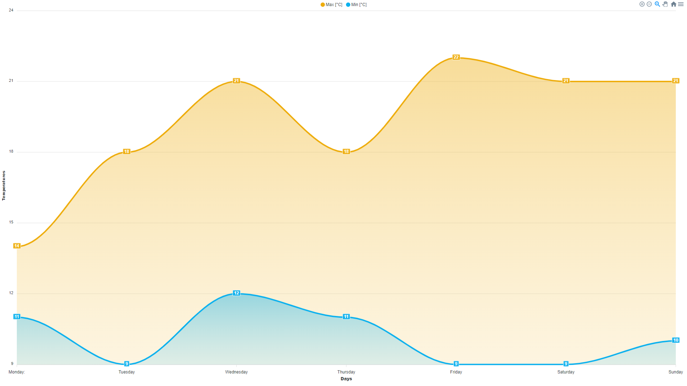

<h1 align="center" style="margin-top: 0px;">Area chart CWC made for WinCC Unified</h1>

<p align="center" style="margin-bottom: 0px !important;">
  
</p>


### **1. CONTENT**

HTML area chart element done with ApexChart

### **2. INTERFACE**

  - **X_axis** : Array of element to draw the X axis of the chart 

  ```js 
      // Example
      X_axis: [["2024-04-30 09:28:41", "2024-04-30 09:35:42", "2024-04-30 09:36:43", "2024-04-30 09:37:44", "2024-04-30 09:38:45", "2024-04-30 09:38:55"]]
  ```

  - **Y_axis** : Array of element to draw the Y axis of the chart 

  ```js 
      // Example
      Y_axis: [["390.00", "375.00", "380.00", "385.00", "390.00", "395.00"]]
  ```
  
  - **DataName** : Array of strings with the name for each series

  ```js
      // Example
      DataName: ["Max °C"]
  ```

  - **X_axisname** : Name of the X axis (i.e. "Days")
  
  - **Y_axisname** : Name of the Y axis (i.e. "Temperatures")

  - **SeriesColor** : Array of string with the color in Hex format for each series

  ```js
      // Example
      SeriesColor: ["#ee730d","#1183e8"]
  ```

  - **SeriesLabels** : Flag to hide or show (False / True) the labels on the series (i.e. true)
  
  - **ShowLine** : Flag to hide or show (False / True) the line on the series (i.e. true)

  - **LineType** : Draw smooth lines or straight lines (i.e. "Smooth")

  - **XAxisType** : Type of data to show on the X axis (Category / Datetime / Numeric) (i.e. "Datetime")

  - **ChartType** : Type of chart to draw (Line / Area / Bar) (i.e. "Area")
### **3. EVENTS**

  - **//**

### **4. USAGE**

  - OFFLINE MODE
    - You can test the behavior of the chart with custom data by setting "production" to false
    - Now you can change all the data from "WebCC.Properties"

    ```js
    var production = false;
    //...
    WebCC.Properties = {
          X_axis: [["2024-04-30 09:28:41", "2024-04-30 09:35:42", "2024-04-30 09:36:43", "2024-04-30 09:37:44", "2024-04-30 09:38:45", "2024-04-30 09:38:55"],
          ["2024-04-30 09:28:41", "2024-04-30 09:32:42", "2024-04-30 09:36:43", "2024-04-30 09:37:44", "2024-04-30 09:38:45", "2024-04-30 09:38:55"]],
          Y_axis: [["390.00", "375.00", "380.00", "385.00", "390.00", "395.00"],["160.00", "255.00", "530.00", "415.00", "290.00", "295.00"]],
          DataName: ["Temperature 1", "Temperature 2"],
          X_axisname: 'Time',
          Y_axisname: 'Kw',
          SeriesColor: ["#EE730D", "#0DCFEE"],
          SeriesLabels: false,
          ShowLine: false,
          LineType: 'Straight',
          XAxisType: 'DateTime',
          ChartType: 'Area'
    };
    ```

  - ONLINE MODE (WinCC Unfied)
    -  Set "production" to true
    ```js
    var production = true;
    ```
    - To import the custom web control the hierarchy of folders and files must be compressed in ZIP format.
    - The name of the ZIP must be the GUID used the "manifest.json" file surrounded by curly brackets

    ```json
      type": "guid://4703190B-4D05-4F16-B52C-B4E3B46092C2",
    ```
    - {4703190B-4D05-4F16-B52C-B4E3B46092C2}.zip
    - If you want this custom web control available for all your project, copy this file in the folder : 
      - C:\Program Files\Siemens\Automation\Portal V17\Data\Hmi\CustomControls
      - replace "Porla V17" with your Tia version.
    - If you want to use this custom web control only in one project copy this file in the folder :

      - \path_to_tia_project\UserFiles


    - Refresh "My controls" to update the files in TIA Portal
    - Now you can place the custom web control in the Screen.

      <p align="center" style="margin-bottom: 0px !important;">
        
      </p> 

