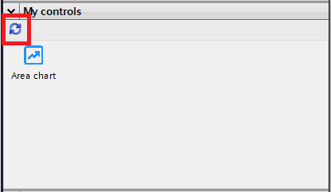

<h1 align="center" style="margin-top: 0px;">Area chart CWC made for WinCC Unified</h1>

<p align="center" style="margin-bottom: 0px !important;">
  
</p>


### **1. CONTENT**

HTML area chart element done with ApexChart

### **2. INTERFACE**

  - **X_axis** : Array of element to draw the X axis of the chart (i.e. ["Monday", "Tuesday", "Wednesday", "Thursday", "Friday", "Saturday", "Sunday"])

  - **Y_axis** : String in array format of numbers to draw the seires of the chart (i.e. "[[18, 21, 22, 16, 19, 21, 21, 21],[7, 9, 11, 11, 9, 12, 11, 11]]")
  
  - **DataName** : Array of strings with the name for each series (i.e. ["Max °C","Min °C"])
    
  - **X_axisname** : Name of the X axis (i.e. "Days")
  
  - **Y_axisname** : Name of the Y axis (i.e. "Temperatures")

  - **SeriesColor** : Array of string with the color in Hex format for each series (i.e. ["#ee730d","#1183e8"])
  
  - **SeriesLabels** : Flag to hide or show (False / True) the labels on the series (i.e. "True")
  
  - **LineType** : Draw smooth lines or straight lines (i.e. "Smooth")
### **3. EVENTS**

  - **//**

### **4. USAGE**

  - OFFLINE MODE
    - You can test the behavior of the chart with custom data by setting "production" to false
    - Now you can change all the data from "WebCC.Properties"

    ```js
    var production = false;
    //...
    WebCC.Properties = {
      X_axis: ["Monday", "Tuesday", "Wednesday", "Thursday", "Friday", "Saturday", "Sunday"],
      Y_axis: "[[18, 21, 22, 16, 19, 21, 21, 21],[7, 9, 11, 11, 9, 12, 11, 11]]",
      SeriesColor: ["#ee730d","#1183e8"],
      DataName: ["Max °C", "Min °C"],
      X_axisname: 'Days',
      Y_axisname: 'Temperatures',
      SeriesLabels: 'True',
      LineType: 'smooth'
    };
    ```

  - ONLINE MODE (WinCC Unfied)
    - To import the custom web control the hierarchy of folders and files must be compressed in ZIP format.
    - The name of the ZIP must be the GUID used the "manifest.json" file surrounded by curly brackets

    ```json
      type": "guid://4703190B-4D05-4F16-B52C-B4E3B46092C2",
    ```
    - {4703190B-4D05-4F16-B52C-B4E3B46092C2}.zip
    - If you want this custom web control available for all your project, copy this file in the folder : 
      - C:\Program Files\Siemens\Automation\Portal V17\Data\Hmi\CustomControls
      - replace "Porla V17" with your Tia version.
    - If you want to use this custom web control only in one project copy this file in the folder :

      - \path_to_tia_project\UserFiles


    - Refresh "My controls" to update the files in TIA Portal
    - Now you can place the custom web control in the Screen.

      <p align="center" style="margin-bottom: 0px !important;">
        
      </p> 
  
